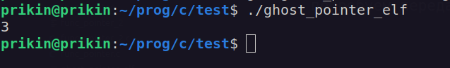
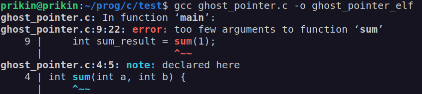
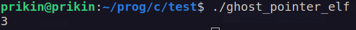
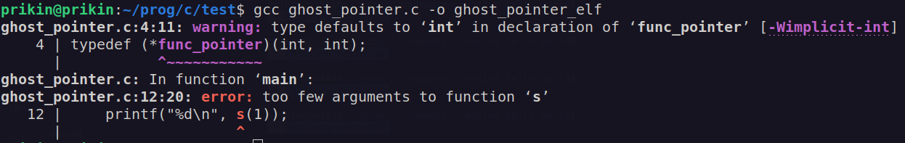
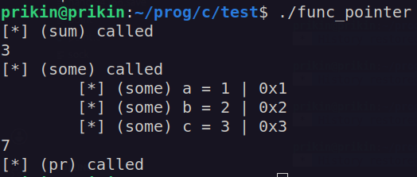
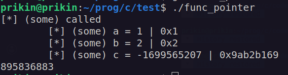
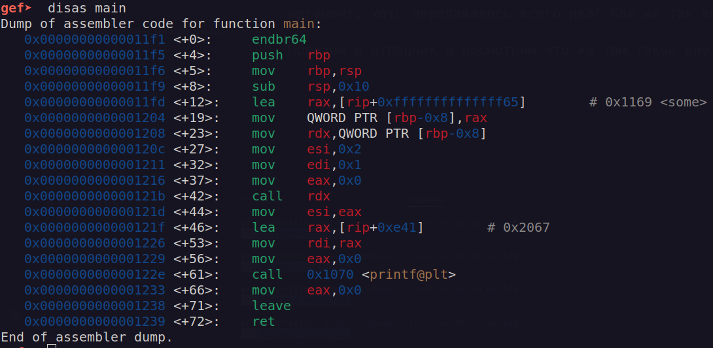
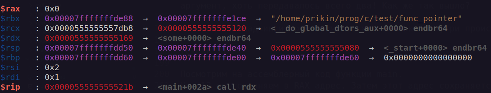
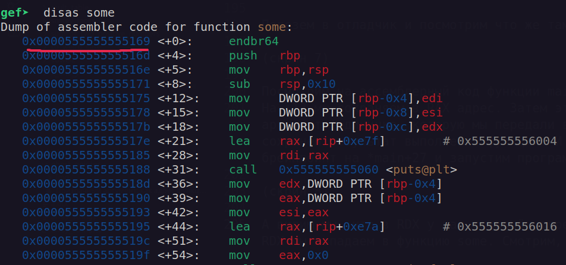
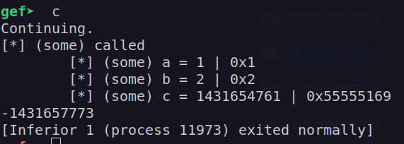

# Призрачный аргумент: как адрес функции пробрался в третий параметр

## Общая информация
  - Автор: [cr0k0Hub](https://github.com/cr0k0Hub)
  - Дата: 23.03.2026

## Предысловие

### Функции
Во многих языках программирования есть поддержка работы с функциями. Функция - часть кода, которому можно дать название. Затем этот код можно вызывать по названию, которое мы указали. Жутко удобная штука. Основной синтаксис следующий:

``` c
тип_результата название_функции(аргументы) {
    код
    return результат;
}
```

Тип резульата - тип возвращаемого значения. Если функция должна вернуть что-то из себя, чтобы это значение можно было использовать где-либо ещё в программе - нужно объяснить компьютеру как с этим значением работать. Это будет число? Адрес? Символ? Именно это и нужно указать. 

Название функции может быть почти что любым. Главное - не начинать название с цифр. И будет очень хорошо, если название будет осмысленным и отражать суть того, что она делает.

Аргументы - значения, которые мы хотим использовать в функции. Их может и не быть. Можно рассматривать их как настройки для нашей функции. Если мы захотим написать функцию, которая возводит число в квадрат, то аргументом будет именно то число, которое мы хотим возвести в квадрат.

return - ключевое слово для выхода из функции и передачи значения, полученного в функции, в часть программы, которая эту функцию и вызывала.

Попробуем написать что-нибудь более конкретное. Например, простую функцию, которая будет считать сумму двух чисел и возвращать её. 

``` c
int sum(int a, int b) {
    return a + b;
}
```

Теперь у нас есть функция sum(), которая принимает в себя два числа, складывает их и возвращает результат сложения. Отлично! Чтобы использовать функцию - нужно написать где-либо её название и передать нужное количество аргументов. Вот более полный код:

``` c
#include <stdio.h>
#include <stdlib.h>

int sum(int a, int b) {
    return a + b;
}

int main() {
    int sum_result = sum(1, 2);
    printf("%d\n", sum_result);

    return EXIT_SUCCESS;
}
```

Теперь у нас есть функция main(), в которой и будет выполняться весь код. Создаём переменную, записываем в неё результат функции, которая принимает два аргумента. Их мы и указали в скобках. 



Но что, если мы попробуем передать неправильное количество аргументов? Например, не два, а один?

*Для сокращения размера я оставлю только main.*
``` c
int main() {
    int sum_result = sum(1);
    printf("%d\n", sum_result);

    return EXIT_SUCCESS;
}
```



Теперь компилятор не хочет собирать нашу программу, говоря, что недостаточно аргументов. И это так. 
Прежде чем перейдём к основной теме статьи, расскажу про указатели на функцию.

### Указатель на функцию

Как до этого было сказано, функция - часть кода с названием. И код этот лежит где-то в нашей программе, а значит у него есть адрес. Именно этот самый адрес мы сможем использовать для обращения к нашей функции, но сначала придётся объявить тип самого указателя. 

Общий синтаксис следующий:
``` c
typedef (*название)(типы_аргументов);
```

``` c
typedef (*func_pointer)(int, int);
```

Здесь мы создаём свой тип, который я назвал func_pointer (то, что после typedef). Это указатель на функцию, которая принимает два числа. А теперь перепишем нашу программу так, чтобы мы использовали не саму функцию, а её адрес:

``` c
#include <stdio.h>
#include <stdlib.h>

typedef (*func_pointer)(int, int); // объявляем тип

int sum(int a, int b) {
    return a + b;
}

int main() {
    func_pointer s = sum;         // записываем в указатель типа func_pointer с названием s адрес sum
    printf("%d\n", s(1, 2));      // вместо названия функции подставляем её указатель

    return EXIT_SUCCESS;
}
```

Запускаем и радуемся. Оно действительно работает.



Попробуем передать в функцию один аргумент, а не два, как мы это сделали в прошлый раз. 

``` c
printf("%d\n", s(1));
```

Компилятор, как и ожидалось, не даёт нам собрать такую программу. 



Самый интересный фокус заключается в том, что мы можем создать указатель с переменным количеством аргументов. Что это значит? А значит это то, что один и тот же указатель мы можем использовать для функций с разным количеством и типом аргументов. 

Перепишем код под эту задачу. Добавим ещё пару функций с разным количеством аргументов:

``` c
#include <stdio.h>
#include <stdlib.h>

typedef int (*func_pointer)(); // указатель на функцию  с переменным количеством аргументов. По факту мы их просто
                    // не указали

int sum(int a, int b) { // функция, которая считает сумму. Принимает 2 аргумента
    printf("[*] (sum) called\n");
    return a + b;
}

int some(int a, int b, int c) {    // функция принимает 3 аргумента
    printf("[*] (some) called\n"); // вывод сообщений для того, чтобы посмотреть что внутри функции
    printf("\t[*] (some) a = %d | 0x%x\n", a, a);
    printf("\t[*] (some) b = %d | 0x%x\n", b, b);
    printf("\t[*] (some) c = %d | 0x%x\n", c, c);
    return a + b * c;
}

void pr() { // функция ничего не принимает, так ещё и void. Ничего не возвращает
    printf("[*] (pr) called\n");
}

int main() { 
    func_pointer func = sum; printf("%d\n", func(1, 2)); // создаём указатель с именем func и записываем
                                                         // в него
                                                         // адрес функции sum. Передаём все аргументы
                                                         // и выводим результат. То же самое делаем 
                                                         // для каждой
                                                         // функции. Передаём нужное количество
                                                         // аргументов и выводим результат
    func = some; printf("%d\n", func(1, 2, 3));
    func = pr; func();

    return EXIT_SUCCESS;
}Не полагайтесь на неопределённое поведение.
UB — это не магия, а бомба замедленного действия. Она может взорваться в самый неподходящий момент: после обновления компилятора, включения оптимизаций или на другой архитектуре.
```

Теперь у нас есть функция sum(), которая принимает два аргумента. Функция some(), которая принимает 3 аргумента, и функция pr(), которая вообще ничего не принимает. Все они выводят сообщение о том, что они были вызваны. А функция some() ещё и показывает аргументы, которые мы в неё передали. 



Получается, что мы можем использовать один указатель, чтобы работать с разными функциями. Это же круто! Но, что если мы теперь попробуем передать неправильное количество аргументов? 

## Undefined behavior и призрачный аргумент

У нас есть указатель на функцию без прототипа, т.е. с отключенной проверкой аргументов. Его работу мы уже поняли. Давайте теперь подправим код. Я уберу лишние функции (sum() и pr()), т.к. в этом конкретном примере они ни на что не повлияют. Также передадим в some() не три, а два аргумента:

``` c
#include <stdio.h>
#include <stdlib.h>

typedef int (*func_pointer)(); // указатель на функцию

int some(int a, int b, int c) { // функция принимает 3 аргумента
    printf("[*] (some) called\n");
    printf("\t[*] (some) a = %d | 0x%x\n", a, a);
    printf("\t[*] (some) b = %d | 0x%x\n", b, b);
    printf("\t[*] (some) c = %d | 0x%x\n", c, c);
    return a + b * c;
}

int main() { 
    func_pointer func = some; 
    printf("%d\n", func(1, 2)); // передаём только лишь 2 аргумента

    return EXIT_SUCCESS;
}
```

Пробуем собрать нашу программу и... 



Наша программа не только собралась, так ещё и не упала во время исполнения. И в ней появился третий аргумент, хоть передавалось всего два! Как же так вышло?

Полезем в отладчик и посмотрим что же там такое внутри происходит. 



Посмотрим на ассемблерный код функции main. 
На +12 мы сохраняем в RAX адрес. Затем этот адрес сохраняется в RDX. В EDI у нас сохраняется наш первый аргумент (единичка, которую мы передали в функцию), в ESI сохраняется второй аргумент. В EAX будет сохранён результат выполнения функции. И вызывается функция по адресу, который лежит в RDX. Поставим брейппоинт на *main+27 и запустим программу. Посмотрим, что же конкретно у нас сохранилось в RDX. 



А видим мы, что в RDX у нас сохранён адрес 0x0000555555555169. При переходе по адресу, который хранится в RDX мы попадаем в функцию some. Смотрим, где она у нас находится:



А находится она у нас как раз по адресу 0x0000555555555169. Продолжим выполнение программы до конца.



Видим вывод: a = 1, что логично, ведь мы передали в него 1. b = 2, что тоже логично, мы же передали в него 2. А c = 0x55555169... Мы же ничего в него не передавали! Что это? А это у нас как раз адрес самой функции some(). Только 32-битный, а не 64. Как так вышло? 


Посмотрим что же у нас просходит в функции some. 

``` asm
0x0000555555555169 <+0>:	endbr64
   0x000055555555516d <+4>:	push   rbp
   0x000055555555516e <+5>:	mov    rbp,rsp
   0x0000555555555171 <+8>:	sub    rsp,0x10
   0x0000555555555175 <+12>:	mov    DWORD PTR [rbp-0x4],edi
   0x0000555555555178 <+15>:	mov    DWORD PTR [rbp-0x8],esi
   0x000055555555517b <+18>:	mov    DWORD PTR [rbp-0xc],edx
   0x000055555555517e <+21>:	lea    rax,[rip+0xe7f]        # 0x555555556004
   0x0000555555555185 <+28>:	mov    rdi,rax
   0x0000555555555188 <+31>:	call   0x555555555060 <puts@plt>
   0x000055555555518d <+36>:	mov    edx,DWORD PTR [rbp-0x4]
   0x0000555555555190 <+39>:	mov    eax,DWORD PTR [rbp-0x4]
   0x0000555555555193 <+42>:	mov    esi,eax
   0x0000555555555195 <+44>:	lea    rax,[rip+0xe7a]        # 0x555555556016
   0x000055555555519c <+51>:	mov    rdi,rax
   0x000055555555519f <+54>:	mov    eax,0x0
   0x00005555555551a4 <+59>:	call   0x555555555070 <printf@plt>
   0x00005555555551a9 <+64>:	mov    edx,DWORD PTR [rbp-0x8]
   0x00005555555551ac <+67>:	mov    eax,DWORD PTR [rbp-0x8]
   0x00005555555551af <+70>:	mov    esi,eax
   0x00005555555551b1 <+72>:	lea    rax,[rip+0xe79]        # 0x555555556031
   0x00005555555551b8 <+79>:	mov    rdi,rax
   0x00005555555551bb <+82>:	mov    eax,0x0
   0x00005555555551c0 <+87>:	call   0x555555555070 <printf@plt>
   0x00005555555551c5 <+92>:	mov    edx,DWORD PTR [rbp-0xc]
   0x00005555555551c8 <+95>:	mov    eax,DWORD PTR [rbp-0xc]
   0x00005555555551cb <+98>:	mov    esi,eax
   0x00005555555551cd <+100>:	lea    rax,[rip+0xe78]        # 0x55555555604c
   0x00005555555551d4 <+107>:	mov    rdi,rax
   0x00005555555551d7 <+110>:	mov    eax,0x0
   0x00005555555551dc <+115>:	call   0x555555555070 <printf@plt>
   0x00005555555551e1 <+120>:	mov    eax,DWORD PTR [rbp-0x8]
   0x00005555555551e4 <+123>:	imul   eax,DWORD PTR [rbp-0xc]
   0x00005555555551e8 <+127>:	mov    edx,eax
   0x00005555555551ea <+129>:	mov    eax,DWORD PTR [rbp-0x4]
   0x00005555555551ed <+132>:	add    eax,edx
   0x00005555555551ef <+134>:	leave
   0x00005555555551f0 <+135>:	ret
```

В начале мы сохраняем на стек наши аргументы.EDI, ESI, EDX. В RAX сохраняем адрес стркои, которую хотим вывести, и вызываем функцию puts, которая и выводит наше сообщение на экран.
```
+ [*] (some) called
```

Далее мы поочерёдно перебираем значения аргументов и выводим их в формате:
```
[*] (some) аргумент = значение | значение_hex
```

Таким образом мы и выводим адрес, который у нас сохранился в RDX. Но всё-таки, почему так?

### Соглашения о вызовах

Есть такая штука, как соглашение о вызовах. Это соглашение определяет куда передавать параметры для программ. В Linux используется System V AMD64 ABI. Это значит, что:

- Первый аргумент идёт в EDI
- Второй аргумент идёт в ESI
- Третий аргумент идёт в EDX
- Четвёртый аргуменет идёт в ECX
- Пятый аргумент идёт в R8
- Шестой аргумент идёт в R9 
- Все последующие сохранятся на стек

Вернёмся к нашему main и some. В EDI мы сохранили число 1. В ESI мы сохранили число 2. По идее, следующий аргумент должен был сохраниться в EDX, но мы его не передали. Вот и получилось так, что у нас подтянулось значние, которое уже лежало в EDX. По чистой случайности вышло, что в EDX у нас был адрес функции some().Если изменить код, добавить какие-либо инструкции, то может произойти уже что угодно. Программа может упасть, выдать мусор (что здесь и произошло, но мусор оказался больно уж интересный), сделать что угодно. Это и называется UNDEFINED BEHAVIOR - неопределённое поведение. 

## Заключение

На мой взгляд, этот случай был очень инетерсным. Сама по себе возможность использовать указатель на функцию и не зависеть от количества аргументов звучит очень заманчиво. Только беда в том, что это может привести к самым разным и неожиданным ситуациям. 

Мы в очередной раз убедились в том, что C не защищает нас от UB. Программа, которая была написана с ошибкой - заработала и даже вывела результат. Благодаря отладчику получилось пролить свет на то, почему так вышло и что же за значение вывелось. 

Что нужно запомнить?

  1. Всегда указывайте полные прототипы для указателей на функции.
Вместо typedef int (*f)(); пишите typedef int (*f)(int, int, int);. Тогда компилятор будет проверять количество и типы аргументов и не позволит вам ошибиться.

  2. Не полагайтесь на неопределённое поведение.
UB — это не магия, а бомба замедленного действия. Она может взорваться в самый неподходящий момент: после обновления компилятора, включения оптимизаций или на другой архитектуре.

Лично я получил радость от этого небольшого исследования. Надеюсь, что и Вы были рады прочитать этот разбор. 